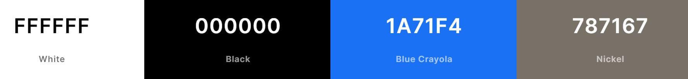
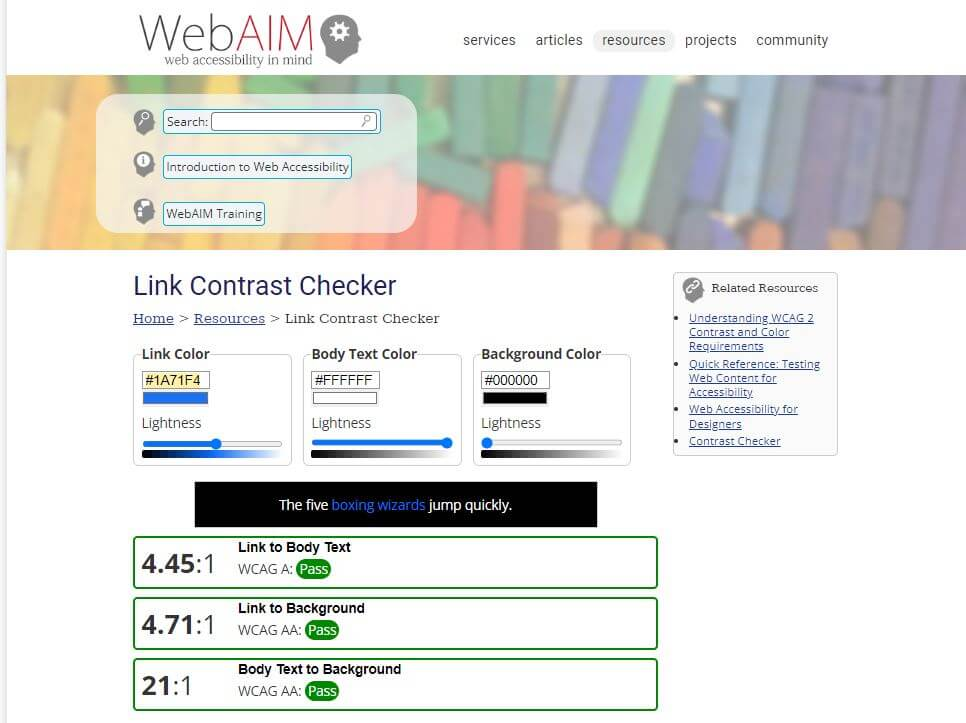

<h1 align="center"> GALAXY AND BEYOND</h1>

[View the deployed Galaxy and Beyond](https://grounded-earth-holistics.herokuapp.com/) <-- update deployed url link

**Please note: To open any links in this document in a new browser tab, press 'CTRL + Click'.**

# Table of Contents

<b>(click to expand or hide)</b>

<!-- Markdown TOC -->

1. [Description](#description)
2. [User Experience (UX)](#user-experience-ux)
    * [User Stories](#user-stories)
    * [5 Planes](#5-planes)
      1. [Strategy](#strategy)
      2. [Scope](#scope)
      3. [Structure](#structure)
      4. [Skeleton](#skeleton)
      5. [Surface](#surface)
          * [Colour Scheme](#colour-scheme)
          * [Typography](#typography)
          * [Imagery](#imagery)
3. [Features](#features)
4. [Technologies Used](#technologies-used)
5. [Testing](#testing)
6. [Lessons Learned](#lessons-learned)
7. [Deployment](#deployment)
8. [Credits](#credits)
    * [Code](#code)
    * [Content](#content)
    * [Media](#media)
    * [Acknowledgements](#acknowledgements)

<!-- /Markdown TOC -->

# Description 

Hi I'm [Megan](https://github.com/Medusas71) and I'm [Manni](https://github.com/manni8436) and we are part of the Nerd Alert Team (logo). We are collaborating together to expand our coding experience.

Our first project, Galaxy and Beyond is a website all about Planets, Galaxies and the History of Space. Space is something we are both curious about. It is fascinating to see all the stars in the sky and know there are other planets in our solar system.

We hope you enjoy our site and learn something new.

[Back to Table of Contents](#table-of-contents)

# User Experience (UX)

## User Stories  

First Time Customer Goals

* As a first time customer to the website, I would like to:
  * Look at the different planets and their relevant information on each planet
  * Find out more information regarding Galaxies
  * Look at the history of space
  * Find out some Fascinating Facts regarding Space, Planets and Galaxies
  * Be able to contact the owners of the website
  * Find out more about the people that created the website and why they created the website

[Back to Table of Contents](#table-of-contents)

## 5 Planes

### 1. Strategy

The purpose of this project is to create a site where users can learn about Planets, Galaxies and the History of Space.

### 2. Scope

The features of this project will include:

* The ability to:
  * view planets
  * find out information regarding planets
  * view galaxies
  * find out information regarding galaxies
  * view the history of space
  * find out information regarding the history of space
  * be able to contact the developers of the site
  * find out more about the developers of the site and why they chose space for their website

### 3. Structure

The information is grouped logically for all users. The Interaction Design (IXD) will be consistent between pages where the navigation bar is fixed and tailored to have the priority items displayed first at the top of the screen. The footer will also be consistent between pages and the footer is fixed at the bottom of the page. The site will be consistent with what users expect from a space website.

### 4. Skeleton

The [wireframes](./assets/documents/wireframes/galaxies-and-beyond.pdf) have been created using [Balsamiq](https://balsamiq.com) and were created for Desktop, Tablet and Phone. 

Here are the individual wireframes:

* [Home Page Wireframe](/assets/images/readme-images/wireframes/home-page.png)
* [Planets Wireframe](/assets/images/readme-images/wireframes/planets.png)
* [Individual Planets Wireframe](/assets/images/readme-images/wireframes/individual-planet.png)
* [Galaxies Wireframe](/assets/images/readme-images/wireframes/galaxies.png)
* [Individual Galaxy Wireframe](/assets/images/readme-images/wireframes/individual-galaxy.png)
* [History Wireframe](/assets/images/readme-images/wireframes/history.png)
* [About Wireframe](/assets/images/readme-images/wireframes/about-us.png)
* [Contact Us Wireframe](/assets/images/readme-images/wireframes/contact-us.png)
* [404 Error Wireframe](/assets/images/readme-images/wireframes/404-error.png)

### 5. Surface 

Colour Scheme

* The colour scheme represents space, by using a background colour of black #000 on all links and white #fff for all text.
* Originally we used the standard blue for the hover colour, but that did not pass accessibility, so it was changed to a blue crayola #1A71F4.
* A nickel colour of #787167 is used around the menu links and throughout each page at the bottom of the header, top of the footer and around each card.
* The header and footer have the same background image - see Imagery.
* The body of each page has the same background image - see Imagery.

Colours were displayed using [Coolors](https://coolors.co/ffffff-000000-1a71f4-787167).

* The colours were checked through [WebAIM](https://webaim.org/resources/contrastchecker/) to ensure the final colours were accessible.

Typography

* The fonts were sourced from [Google Fonts](https://fonts.google.com/).
* The Trispace font is the main font used throughout the whole website with sans-serif as the fallback font.
* This font was chosen due to it being a 'space' font.

Imagery

* The header and footer background both use a stary-sky image that was sourced from XXX? (insert link here).
* Each page has a space shuttle in the header that slides in when navigating to any page. The space shuttle was sourced from XXX? (Insert link here)
* The body background uses a star image that was sourced from http://fc01.deviantart.net/fs71/f/2012/160/b/9/stars_by_paulinemoss-d52un4e.jpg by a google search and an animation was added so the stars are constantly moving.
* The 404 error page image was sourced from https://www.behance.net/gallery/123773233/Error-404-landing-page-template?tracking_source=search_projects_recommended%7C404%20oops by searching 404 Error Space in Google.

[Back to Table of Contents](#table-of-contents)

Features
---

**Current Features**

**Future Features to implement**

[Back to Table of Contents](#table-of-contents)
Technologies Used
---

**Languages**

1. [HTML5](https://en.wikipedia.org/wiki/HTML5)
2. [CSS3](https://en.wikipedia.org/wiki/CSS)
3. [JavaScript](https://en.wikipedia.org/wiki/JavaScript)

**Frameworks and Libraries**

1. [Bootstrap 5.1 CDN](https://getbootstrap.com/docs/5.1/getting-started/introduction/) - to make the website responsive

**Programs and Resources**

<!-- 1. [Am I Responsive](https://ui.dev/amiresponsive) - to create a Home Page image on each device for use in the Readme file -->
<!-- 1. [Autoprefixer CSS Online](https://autoprefixer.github.io/) - to ensure all vendor prefixes were included in CSS -->
1. [Balsamiq](https://balsamiq.com/) - wireframes
1. [Coolors](https://coolors.co/) - to display colour palette
<!-- 1. [Favicon Generator](https://favicon.io/emoji-favicons/) - to generate the favicon -->
<!-- 1. [Font Awesome](https://fontawesome.com/v5/search) - for their icons -->
1. [Git](https://git-scm.com/) - version control
1. [GitHub](https://github.com/) - used to store the project files
1. [Gitpod](https://www.gitpod.io/) - IDE
1. [Google Fonts](https://fonts.google.com/) - typography
<!-- 1. [Lighthouse](https://developer.chrome.com/docs/lighthouse/overview/) - to check for issues on all pages -->
1. [Slack](https://slack.com/) - main source of assistance from other students, developers and documents/resources
1. [Snagit](https://www.techsmith.com/screen-capture.html) - screen capture and resizing images
1. [TinyPNG](https://tinypng.com/) - efficient compression of images for the site
1. [W3Schools](https://www.w3schools.com/) - to assist with the code
<!-- 1. [Wave](https://wave.webaim.org/) - to ensure the content was accessible -->
1. [WebAIM](https://webaim.org/resources/contrastchecker/) - web accessibility contrast checker

[Back to Table of Contents](#table-of-contents)

Testing
---

[See Testing.md for testing information](TESTING.md)

[Back to Table of Contents](#table-of-contents)

Lessons Learned
---

(add new lessons learned for each of us and together)

[Back to Table of Contents](#table-of-contents)

Deployment
---

The code for this website was written in [Gitpod](https://www.gitpod.io/), pushed to [GitHub](https://github.com/) and was deployed using [Heroku](https://www.heroku.com/) <--- (change for GitHub pages).

The following process was used to deploy this website:

(add deployment text here)

**How to Fork a Repository**

1. Login to GitHub
2. On GitHub go to: https://github.com/Medusas71/Megs-Italian-Kitchen (update link)
3. Click "Fork" on the top right of the screen.

**Run this site locally/clone site**

You can clone this repository directly into an editor of your choice and run the site locally.

To do this:

(add clone text here)

[Back to Table of Contents](#table-of-contents)

Credits
---

Code

* A large portion of the code was developed following the Code Institute's Boutique Ado walkthrough
* I followed [MDB - mdbootstrap](https://mdbootstrap.com/how-to/bootstrap/footer-add/) on how to add a footer

Content  

* Majority of the content was taken from the original [Grounded Earth Holistics website](https://www.groundedearthholistics.com.au/) 
with permission from the business to use their website for my project

Media
---

Acknowledgements
---

[Back to Table of Contents](#table-of-contents)